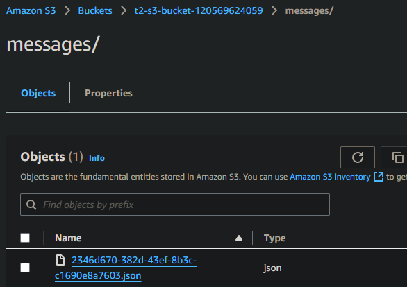

CloudFormation Templates for Microservices Deployment

Folder Structure
microservice1/ - Contains app.py and Dockerfile for Microservice 1.
microservice2/ - Contains app2.py and Dockerfile for Microservice 2.
All CloudFormation templates are located in the root folder.
Prerequisites
AWS CLI and AWS SDK
Permissions to create and manage AWS resources in your account.
Configure AWS CLI with appropriate credentials and region.
Deployment Steps
Step 0: Clone the Repository

Purpose: Clone this repository to your local machine or the target EC2 instance to access the CloudFormation templates and application files.

Execution:

git clone https://github.com/shaymelamud95/CHECKMARKS-HM.git
cd CHECKMARKS-HM

Setting Up Environment Variables
create an .env file to store commonly used parameters, such as the Prefix, and load it into your environment before running AWS CLI commands.

Step 1: Create the .env File
In the project directory, create a file named .env.
Add the following line to define the prefix

# .env file
PREFIX=t1  # Replace 't1' with your chosen prefix
Load Environment Variables from the .env File
Use the following command to load the variables from the .env file:

export $(grep -v '^#' .env | xargs)
This command will load all environment variables defined in .env, making them available in your terminal session.

Step 1: Parameter Store Setup
Template: parameter-store.yaml
Purpose: Stores sensitive data like tokens or credentials used by the microservices.

Execution:

aws cloudformation create-stack --stack-name ${PREFIX}-parameter-store-stack --template-body file://parameter-store.yaml --parameters ParameterKey=MySecretToken,ParameterValue=<your_secret_token_value> --capabilities CAPABILITY_NAMED_IAM
Replace <your_secret_token_value> with the actual secret token you want to store.

Verification:

Go to the AWS Systems Manager Console > Parameter Store.
Check that the parameters (e.g., ${PREFIX}/myapp/token) are created.
Step 2: IAM and ECR User Setup

Template: iam-ecr-user-setup.yaml
Purpose: Creates an IAM user with programmatic access to ECR, S3, SQS, and ECS.
Execution:

aws cloudformation create-stack --stack-name ${PREFIX}-iam-ecr-user-stack --template-body file://iam-ecr-user-setup.yaml --parameters ParameterKey=Prefix,ParameterValue=${PREFIX} --capabilities CAPABILITY_NAMED_IAM

Verification:

Go to the IAM Console and verify that the user with required permissions has been created.

Note: Retrieve the Access Key and Secret Key if needed for local development.
Step 3: S3 and SQS Setup

Template: storage_and_queue.yaml
Purpose: Creates an S3 bucket and SQS queue used by the microservices.
Execution:

aws cloudformation create-stack --stack-name ${PREFIX}-storage-queue-stack --template-body file://storage_and_queue.yaml --parameters ParameterKey=Prefix,ParameterValue=${PREFIX}

Verification:

Go to the S3 Console and verify that the specified bucket is created.
Go to the SQS Console and verify that the queue is created with the expected name.

Step 4: IAM Roles Setup
Template: iam-roles.yaml
Purpose: Sets up the IAM roles for ECS task execution and other roles required by services.

Execution:

aws cloudformation create-stack --stack-name ${PREFIX}-iam-roles-stack --template-body file://iam-roles.yaml --parameters ParameterKey=Prefix,ParameterValue=${PREFIX} --capabilities CAPABILITY_NAMED_IAM

Verification:

Go to the IAM Console > Roles, and verify that the specified roles are created.
Check the role permissions to confirm they have the necessary access.

Step 5: ECR Repositories
Template: ecr-repository.yaml
Purpose: Creates ECR repositories for both microservices.

Execution:

aws cloudformation create-stack --stack-name ${PREFIX}-ecr-repositories-stack --template-body file://ecr-repository.yaml --parameters ParameterKey=Prefix,ParameterValue=${PREFIX}

Verification:

Go to the ECR Console and check that repositories for both microservice1 and microservice2 are created.

Step 6:
infrastructure.yaml
Purpose: Deploys both microservices to ECS using the previously defined task definitions.
Execution:

aws cloudformation create-stack --stack-name ${PREFIX}-infrastructure-stack --template-body file://infrastructure.yaml --parameters ParameterKey=Prefix,ParameterValue=${PREFIX} --capabilities CAPABILITY_NAMED_IAM

Step 7:
before continue with cloudformation templates lets build a docker and push it to the registry: lets automate it with jenkins

Template: jenkins_ec2.yaml

Purpose: Creates an EC2 instance for Jenkins to manage CI/CD pipelines.

Execution:
Step 8: Jenkins EC2 Instance

aws cloudformation create-stack --stack-name ${PREFIX}jenkins-ec2-stack --template-body file://jenkins_ec2.yaml --parameters ParameterKey=Prefix,ParameterValue=${PREFIX} --capabilities CAPABILITY_NAMED_IAM

know that im creating the key pair here from cloudformation template you will not be able to download the .pem file so you can connect via aws console, if you want to use remote ssh instead change the, I wrote aline about it in the code. (line 49)

Verification:

in this EC2 jenkins is allready installed enabled and started,
check : sudo systemctl status jenkins

Go to the EC2 Console and verify that the instance is created.
Once the instance is running, access Jenkins on http://<instance-ip>:8080 to configure and set up pipelines for the microservices.

configure jenkins as it says, copy password create user ec.
when you have jenkins installed:

(or you have jenkins pre installed just make SG and route for the new VPC to comunicate)

while Jenkins installs the recomended plugins lets exec next template:
Execution:
Step 9: ECS Task Definitions

Template: ecs_tasks.yaml

Purpose: Defines ECS task definitions for both microservices, specifying container configurations, environment variables, and IAM roles.

aws cloudformation create-stack --stack-name ${PREFIX}-ecs-tasks-stack --template-body file://ecs_tasks.yaml --parameters ParameterKey=Prefix,ParameterValue=${PREFIX} ParameterKey=ClusterName,ParameterValue=${PREFIX}-Cluster --capabilities CAPABILITY_NAMED_IAM

Verification:

Go to the ECS Console > Task Definitions, and verify that task definitions for both microservice1 and microservice2 are created.
Check the task definitions to ensure they include the correct environment variables and role ARNs.

go to your LB run it in the web and see Welcome to nginx!

Step 10: jenkins CI-CD
create pipeline
paste the code from jenkins-CI-CD.geouvy:
1. set up to your region
2. set up to your ECR_REGISTRY
3. create credentials with the AWS_ACCESS_KEY_ID and AWS_SECRET_ACCESS_KEY	
you can see then in ssm parameter store or in the output template param list (not recomended just for easy access and testing)

run the pipeline and check that new revition in task deff.
and service updated.

you can check in LB the app
and check the /proccess rout for sending message to SQS and resiving it in S3.

for example:
curl -X POST http://t1-alb-772236224.il-central-1.elb.amazonaws.com/process -H "Content-Type: application/json" -d '{
    "data": {
        "email_subject": "Happy new year!",
        "email_sender": "John doe",
        "email_timestream": "1693561101",
        "email_content": "Just want to say... Happy new year!!!"
    },
    "token": "test"
}'
